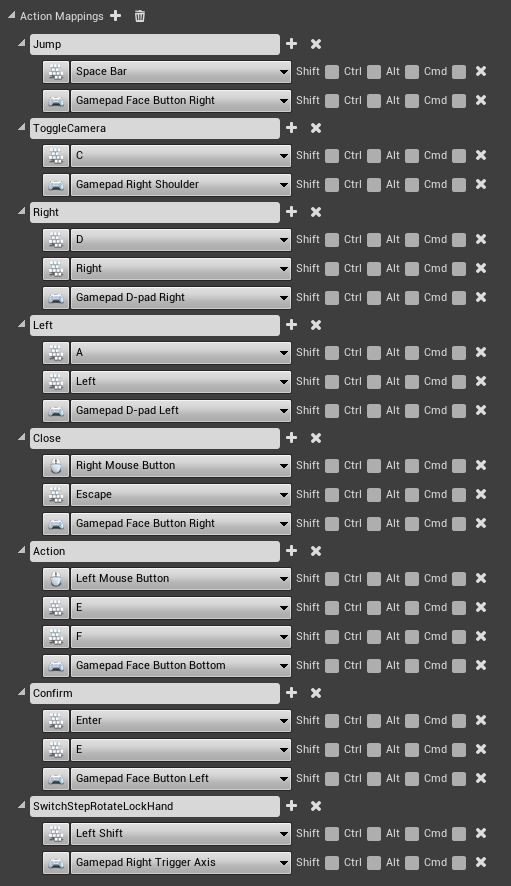

# Input

## **Manually configure control**

### **Action mappings**

### Axis mappings

.png>)

## **Import file with control settings**


Importing a file with control settings will overwrite the existing control.


You can also download a [file](https://drive.google.com/file/d/1i4rNUTNAMF0XJzB7Er-PGyTu8sjrvAPa/view?usp=sharing) with management settings and import it to **Project Settings -> Input -> Import**

.png>)
